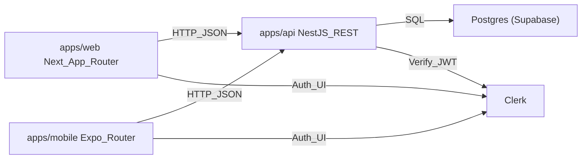
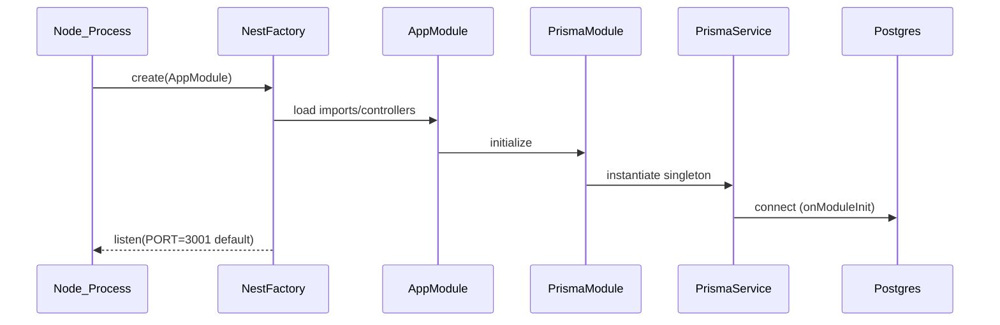
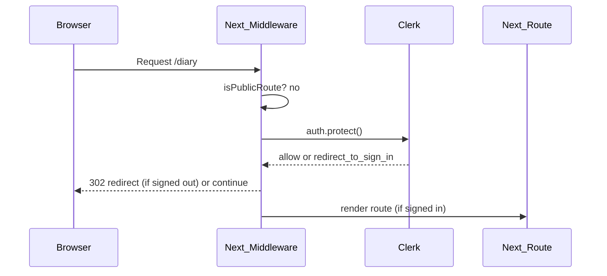
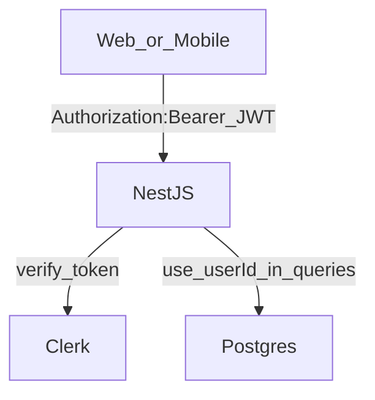

[10 tools called]

### Technical Documentation (Current State)

## System Overview

You now have a working **monorepo** with three runnable apps:

- **Web**: Next.js App Router in `apps/web`
- **Mobile**: Expo + Expo Router in `apps/mobile`
- **API**: NestJS + Prisma (Postgres) in `apps/api`



---

## Repo Layout

```text
apps/
  api/     NestJS API + Prisma
  web/     Next.js App Router + Clerk middleware
  mobile/  Expo + Expo Router
docs/      Architecture + PRD
packages/  shared (future shared types/clients)
```

---

## Backend: `apps/api` (NestJS + Prisma)

### What exists

- **Server bootstrap**: `apps/api/src/main.ts`
- **Root module**: `apps/api/src/app.module.ts`
- **Health endpoints**: `apps/api/src/health.controller.ts`
- **Prisma integration**:
  - schema: `apps/api/prisma/schema.prisma`
  - generated client: `apps/api/src/generated/prisma/`
  - Nest provider: `apps/api/src/prisma/prisma.service.ts`

### Runtime flow (API start)



### Current API endpoints

- `GET /health` → `{ ok: true }`
- `GET /health/db` → runs `SELECT 1` via Prisma and returns `{ ok: true, db: true/false }`

### PrismaService behavior

- Loads env with `dotenv/config`
- Requires `DATABASE_URL`
- Creates Prisma client with `@prisma/adapter-pg`
- Connects on module init, disconnects on shutdown

---

## Database: Prisma schema (what data exists)

Your schema already supports your PRD domain:

- `foods`
- `meal_entries`
- `water_entries`
- `workouts`
- `goals`
- `profiles`
- `streaks`

This is the foundation for your future “Diary” endpoints.

---

## Web: `apps/web` (Next.js App Router + Clerk)

### What exists

- A real Next project (has `package.json` with `dev/build/start`)
- App Router structure:
  - `apps/web/app/layout.tsx` wraps `<ClerkProvider>`
  - `apps/web/app/page.tsx` home
  - `apps/web/app/health/page.tsx` public health page
- Clerk middleware in **`proxy.ts`**:
  - `clerkMiddleware()` from `@clerk/nextjs/server`
  - Protects all routes **except** `/` and `/health(.*)`

### Request protection flow



### Keys / env

- Web uses `.env.local` (not committed) for:
  - `NEXT_PUBLIC_CLERK_PUBLISHABLE_KEY`
  - `CLERK_SECRET_KEY`

---

## Mobile: `apps/mobile` (Expo + Expo Router)

### What exists

- A real Expo project (has `package.json` with `start/ios/android/web`)
- Expo Router structure under `apps/mobile/app/`

### Current state

- Mobile is scaffolded, but **Clerk is not integrated yet** (auth UI + token management still pending).

---

## How to run everything (dev)

### API

```bash
cd apps/api
npm run dev
```

### Web

```bash
cd apps/web
npm run dev -- --hostname 127.0.0.1 --port 3005
```

### Mobile

```bash
cd apps/mobile
npm run start
```

Important dev note:

- **Mobile on a real phone cannot call `localhost`** for your API; it must use your machine’s LAN IP (e.g. `http://192.168.x.x:3001`).

---

## What “auth boundary” means in your architecture

Right now:

- **Web boundary** exists: middleware ensures pages are protected.
- **API boundary** is not implemented yet: the API does not yet verify Clerk JWTs on requests (it’s the next big security step).
- **Mobile boundary** is not implemented yet: no Clerk sign-in/token retrieval.

The intended end state (per your Architecture doc) is:



---

## Next recommended work (based on PRD + Architecture)

- Add Clerk verification to NestJS (guard/middleware) and require auth on all non-health endpoints
- Implement first “Diary MVP” endpoints:
  - `POST /meals`
  - `GET /diary?date=YYYY-MM-DD`
  - `POST /water`
- Add Clerk to mobile (Expo) so mobile can obtain JWT and call API

If you want, I can write this into a `docs/TechnicalDocumentation.md` file for you, but you’re currently in ask mode—tell me to switch to Agent mode and I’ll generate it in-repo.
